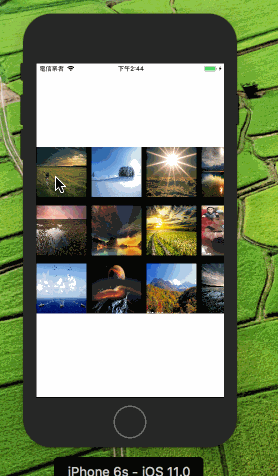

# DZMPhotoBrowser


***
#### 效果:


***
#### 简介:
    支持横竖屏,屏幕旋转,使用简单,注释多可修改程度高,兼容Swift混编使用
    
    无内存泄漏
    
    该框架是基于 SDWebImag e实现的,但是仅在下载图片使用 SDWebImage 的方法。
    
    如果想换成 SDWebImage 以外的框架也是很简单的,删掉SDWeb,然后在 DZMPhotoView.m 中的图片下载处换成别的下载方式即可
    
***
#### DZMPhotoBrowser 使用:
```Objective-C
DZMPhotoBrowser *browser = [[DZMPhotoBrowser alloc] init];

// 设置代理
browser.delegate = self;

// 设置图片模型
browser.photos = photos;

// 设置初始选中(默认就是0)
browser.initSelectIndex = 0;

// 展示
[browser show];
```
#### DZMPhoto 介绍:
```Objective-C
/// 图片URL (网络图片展示使用)
@property (nonatomic, copy, nullable) NSURL *url;

/// 图片 (本地图片展示使用)
@property (nonatomic, strong, nullable) UIImage *image;

/// 图片来源控件 有值则会带有返回动画
@property (nonatomic, weak, nullable) UIImageView *imageView;

注意: 在传入DZMPhotoBrowser的 photos 中,可同时存在本地图模型以及网络图片模型 如果url 以及 image 都有值则使用url
```

#### DZMPhotoBrowserDelegate 介绍:
```Objective-C
/// 将要显示的模型
- (void)photoBrowser:(DZMPhotoBrowser * _Nonnull)photoBrowser willShowPhoto:(DZMPhoto * _Nullable)photo;

/// 当前显示的模型(滚动结束才会调用)
- (void)photoBrowser:(DZMPhotoBrowser * _Nonnull)photoBrowser didShowPhoto:(DZMPhoto * _Nullable)photo;

/// 即将隐藏销毁
- (void)photoBrowser:(DZMPhotoBrowser * _Nonnull)photoBrowser willHiddenPhoto:(DZMPhoto * _Nullable)photo;

/// 完成隐藏销毁
- (void)photoBrowserDidHidden:(DZMPhotoBrowser * _Nonnull)photoBrowser;

/// 图片保存结果
- (void)photoBrowser:(DZMPhotoBrowser * _Nonnull)photoBrowser savePhoto:(DZMPhoto * _Nullable)photo error:(NSError * _Nullable)error;
```

